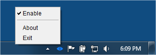

# Awake #

:sleeping: Awake is a alternative to Caffeine to prevent your PC from sleeping.

[](https://github.com/genyherrera/awake/blob/master/LICENSE)
[](https://travis-ci.org/genyherrera/awake)



## What I should use Awake instead of Caffeine ##

Since I started using Caffeine on Windows, which by the way is not nearly as good as the Mac version, I noticed some strange characters appears when I was at command line.

At first didn't care to much, but if you have to work remotely in a mobile connection and is typing at command line (with delay) and suddenly you realize that in the middle of your typing shows a lot of "~ 8", that's exaclty what Caffeine does.

Every 30 seconds, it simulates the action of the F15 key. As there is no keyboard with this specific key they believe that the SO didn't care about it, but Windows translates the command of the F15 key to "~ 8".

If you stop to typing you will see this:


And if you are on the middle of of typing you will see this: 


## Download ##

Download or grab via Maven:
```xml
<dependency>
  <groupId>org.genyherrera.awake</groupId>
  <artifactId>Awake</artifactId>
  <version>1.0-SNAPSHOT</version>
</dependency>
```
or Gradle:
```groovy
compile 'org.genyherrera.awake:awake:1.0-SNAPSHOT'
```

Snapshots of the development version are available in [Sonatype's `snapshots` repository][snap].

Awake requires at minimum Java 7.


## Running ##

```java
java -jar Awake
```

https://search.maven.org/remote_content?g=org.genyherrera.awake&a=awake&v=LATEST
[snap]: https://oss.sonatype.org/content/repositories/snapshots/
 
## License ##

  Copyright (C) 2016 Geny Isam Hamud Herrera (geny.herrera@gmail.com)
 
  Licensed under the Apache License, Version 2.0 (the "License");
  you may not use this file except in compliance with the License.
  You may obtain a copy of the License at
 
          http://www.apache.org/licenses/LICENSE-2.0
 
  Unless required by applicable law or agreed to in writing, software
  distributed under the License is distributed on an "AS IS" BASIS,
  WITHOUT WARRANTIES OR CONDITIONS OF ANY KIND, either express or implied.
  See the License for the specific language governing permissions and
  limitations under the License.
  
